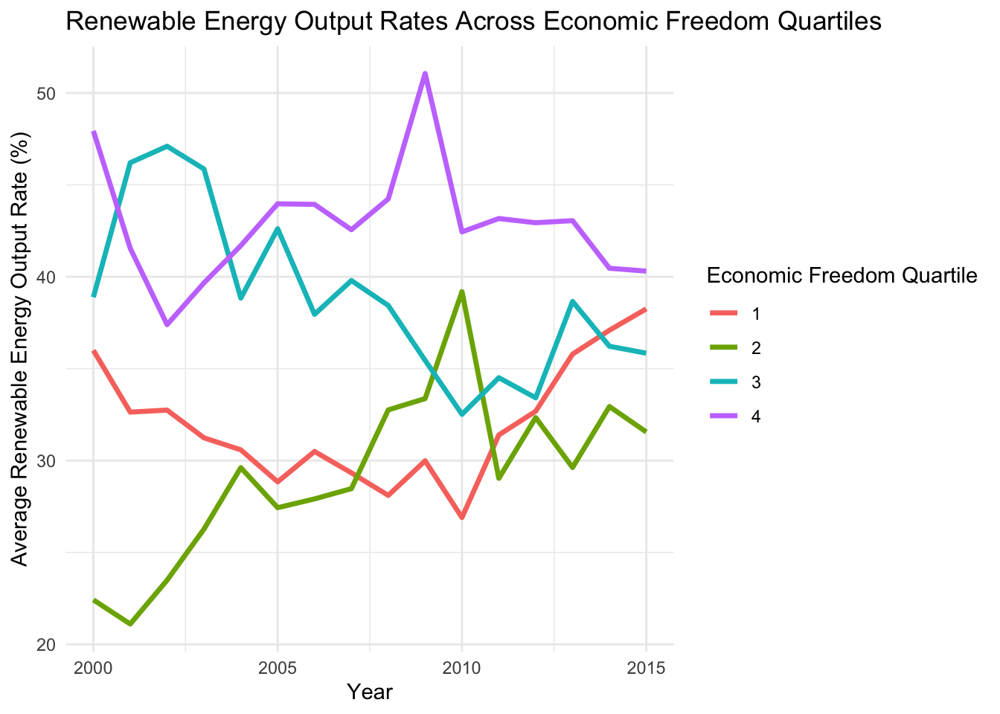

## Introduction

When we scrutinize the relationship between capitalism and environmental impacts, we're engaging in a complex dialogue about efficiency, freedom, and sustainability. Markets act as a powerful mechanism for efficient resource allocation. Yet market-based economies, with the intrinsic drive for growth, often neglect the environmental dimension and impact. This oversight manifests in a key shortcoming: the failure to incorporate environmental costs into the pricing of goods and services.

The role of freedom in global economies brings about a dualistic impact on the environment. The positive aspects are rooted in the innovative potential and efficiency that economic freedom encourages. In a capitalist system, the competitive market can be a catalyst for discovering sustainable and economical production methods. Furthermore, the wealth generated in such systems can boost both private and public investments in environmental initiatives. Regulatory efficiency also stands out as an advantage, offering the ability to quickly adapt and respond to emerging environmental challenges. Unfortunately, there are many reasons why this idealized version falls short. At the end of the day, addressing the climate crisis is a collective action dilemma, since the actions of one person are negligible in the grand scheme of things. This makes it difficult for consumers to support climate-focused goods and services in exchange for relatively cheaper alternatives.

Now, the ugly. Capitalism often leads to aggressive resource use, resulting in issues like deforestation, loss of biodiversity, and water pollution. The tendency of capitalism to prioritize short-term profit over long-term sustainability creates a blind spot for environmental considerations. This short-sighted focus on immediate financial returns often overshadows the broader, more enduring impacts on the environment. Additionally, the burden of environmental degradation in capitalist systems is not evenly distributed. Often, it's the less affluent communities that bear the worst of this degradation, leading to a disparity in environmental impact and quality of life. In fact, the wealthiest 10 percent of the global population are responsible for half of global emissions. [@cnbc]

While capitalism has the potential to foster innovation and generate funds that could benefit environmental conservation, resource exploitation and prioritization of short-term profits present substantial challenges to achieving true environmental sustainability.


### What is *Economic Freedom*?

There is certainly a level of subjectivity, or at least a certain amount of uncertainty, when scoring the freedom of an economy. As a result, it seems impossible to create a perfect score for economic freedom. However, this doesn't mean people haven't tried to create a spectrum to measure how free and open different economies are. 

The *Economic Freedom of the World: 2022 Annual Report* serves as the backbone of the analysis in this exploration. The dataset has a multitude of columns, the most important of which is gives each country an economic freedom index score on a scale from 1 to 10. According to the Fraser Institute, the pillars of their scoring of economic freedom depend on "personal choice, voluntary exchange, freedom to enter markets and compete, and security of the person and privately owned property." [@fraser] This economic freedom score is measured in five areas: size of government, legal system and property rights, sound money, freedom to trade internationally, and regulation. 

In addition to the economic freedom index column, there are a plethora of interesting variables that can be analyzed in this dataset.

The report discusses how countries that are have higher levels of economic freedom outperform less free countries in indicators of well being. Countries in the top quartile of economic freedom saw an average per-caputa GDP of \$48,251 in 2020, while countries in the bottom quartile for economic freedom had an average of \$6,542. Furthermore, life expecancy in the top quartile was 80.4 years and 66 years in the bottom quartile in 2020 [@fraser] However, do these positive impacts of higher economic freedom also lead to better environmental outcomes? This analysis will put this question to the test.

### Environmental Outcomes Analyzed

This analysis will consider several environmental outcomes pulled from the World Bank website. These data include freshwater withdrawal as a proportion of available freshwater resources (water stress), net forest depletion as a percentage of GNI, renewable energy output as a percentage of total energy consumption, renewable energy consumption as a percentage of total energy consumption, and methane emissions in metric tons of CO2 per capita [@worldbank] Combined with the economic freedom data, this will allow for the analysis to look at the relationship between economic freedom scores and related variables to environmental outcomes over time in different countries.

### Predictions


## Analysis

First, let's import the libraries we will need to conduct this analysis.


::: {.cell}

```{.r .cell-code}
# import libraries
library(here)
library(dplyr)
library(tidyverse)
library(ggplot2)
library(janitor)
library(tidyr)
library(forecast)
library(randomForest)
library(tidyverse)

# clear environment for sanity
rm(list = ls())
```
:::


### Data Cleaning

Now, let's import and clean the data containing the freedom index and other scores by country.


::: {.cell}

```{.r .cell-code}
# read in freedom data
freedom_raw <- read.csv('data/efw_ratings.csv', header = FALSE)
```
:::


This data needs a good bit of clean up. This next code chunk adjusts the column headers and converts column types appropriately.


::: {.cell}

```{.r .cell-code}
# set the 5th row as the column names
colnames(freedom_raw) <- freedom_raw[5,]

# remove the first 4 rows since they are now empty and clean names, remove columns 
freedom <- freedom_raw[-c(1:5), ] %>% 
  clean_names() %>% 
  subset(select = -na) %>% 
  subset(select = c(-na_2, -na_3, -na_4, -na_5)) %>% 
  subset(select = -world_bank_region) %>% 
  subset(select = -world_bank_current_income_classification_1990_present)

# convert year columns from char to num
freedom <- freedom %>%
  mutate(across(6:ncol(freedom), as.numeric)) %>% 
  mutate(economic_freedom_summary_index = as.numeric(as.character(economic_freedom_summary_index)))
```
:::


Now, lets move on to reading in the next dataset. The *freedom* data serves as the policy side of the data -- now we want to append and compare environmental outcomes based on different political and economic factors.


::: {.cell}

```{.r .cell-code}
# read in esg data
esg_wb <- read.csv('data/esg_wb.csv') %>% 
  clean_names()
```
:::


This data also needs to be cleaned up a bit. Let's get to work.


::: {.cell}

```{.r .cell-code}
column_names <- c("x1998_yr1998", "x1999_yr1999", "x2000_yr2000", 
                  "x2001_yr2001", "x2002_yr2002", "x2003_yr2003", 
                  "x2004_yr2004", "x2005_yr2005", "x2006_yr2006", 
                  "x2007_yr2007", "x2008_yr2008", "x2009_yr2009", 
                  "x2010_yr2010", "x2011_yr2011", "x2012_yr2012", 
                  "x2013_yr2013", "x2014_yr2014", "x2015_yr2015", 
                  "x2016_yr2016", "x2017_yr2017", "x2018_yr2018", 
                  "x2019_yr2019", "x2020_yr2020", "x2021_yr2021", 
                  "x2022_yr2022")

# Function to extract and convert the year part of a column name to numeric
extract_year <- function(column_name) {
  year_str <- substr(column_name, 2, 5)
  as.numeric(year_str)
}

first <- names(esg_wb)[1:4]

# Apply the function to each column name
numeric_years <- sapply(column_names, extract_year)

new_cols <- c(first, numeric_years)

names(esg_wb) <- new_cols

esg_wb <- esg_wb %>% 
  mutate(across(5:ncol(.), ~ as.numeric(as.character(.))))
```
:::

::: {.cell}

```{.r .cell-code}
# make longer so it is compatible to join with freedom data
esg_wb_long <- esg_wb %>%
  pivot_longer(
    cols = '1998':'2022', # Specify the range of columns to pivot
    names_to = "Year", # Name of the new column that will store the years
    values_to = "Value" # Name of the new column that will store the corresponding values
  ) 
```
:::


Finally, let's merge the datasets together by year and country name.


::: {.cell}

```{.r .cell-code}
# rename the country column in freedom dataset to match esg_wb_long
names(freedom)[names(freedom) == "countries"] <- "country_name"

# rename the year column in freedom dataset to match esg_wb_long
names(freedom)[names(freedom) == "year"] <- "Year"

# perform the join
freedom_esg <- merge(freedom, esg_wb_long, by = c("Year", "country_name"))

freedom_esg <- freedom_esg %>% 
  mutate(Year = as.numeric(as.character(Year)),
         Value = as.numeric(as.character(Value)))

# save dataset as a csv
write.csv(freedom_esg, "freedom_esg.csv", row.names = FALSE)
```
:::


Sweet! Now we have the dataset we will be working with in the analysis. 

### Data Filtering

For convenience, I have created a dataframe for each of the environmental indicators to make the analysis smoother.


::: {.cell}

```{.r .cell-code}
water_stress <- freedom_esg %>% 
  filter(series_name == "Level of water stress: freshwater withdrawal as a proportion of available freshwater resources")

ag_area <- freedom_esg %>% 
  filter(series_name == "Agricultural land (% of land area)")

forest_depletion <- freedom_esg %>% 
  filter(series_name == "Adjusted savings: net forest depletion (% of GNI)")

renewable_output <- freedom_esg %>% 
  filter(series_name == "Renewable electricity output (% of total electricity output)")

renewable_consumption <- freedom_esg %>% 
  filter(series_name == "Renewable energy consumption (% of total final energy consumption)")

methane_emissions <- freedom_esg %>% 
  filter(series_name == "Methane emissions (metric tons of CO2 equivalent per capita)")
```
:::


### Emissions

In the first piece of analysis, let's look at the methane emissions data. The units for which the emissions are recorded in the dataset are metric tons of CO2 equivalent per capita. 

First, let's compare the average emission by economic freedom quartile from 2000 to 2020.


::: {.cell}

```{.r .cell-code}
# create summary table for mean and stdev of methane emissions for each economic freedom quartile
methane_emissions_quartile <- methane_emissions %>% 
  group_by(Year, quartile) %>% 
  summarize(avg_methane = mean(Value, na.rm = TRUE),
            std_methane = sd(Value, na.rm = TRUE)) %>% 
  na.omit()
```

::: {.cell-output .cell-output-stderr}
```
`summarise()` has grouped output by 'Year'. You can override using the
`.groups` argument.
```
:::

```{.r .cell-code}
methane_emissions_plot_with_error <- ggplot(methane_emissions_quartile, aes(x = Year, y = avg_methane, color = as.factor(quartile))) +
  geom_line() +
  labs(title = "Methane Emissions Over Time by Economic Freedom Quartile with Standard Deviation",
       x = "Year",
       y = "Average Methane Emissions (metric tons of CO2 equivalent per capita)",
       color = "Economic Freedom Quartile") +
  theme_minimal()

# Display the plot
methane_emissions_plot_with_error
```

::: {.cell-output-display}
{width=672}
:::
:::

::: {.cell}

```{.r .cell-code}
methane_col_of_interest <- freedom_esg %>% 
  dplyr::select(Year, quartile, country_name, economic_freedom_summary_index, data, data_3, data_6, x5d_freedom_to_enter_markets_and_compete, series_name, Value) %>% 
  filter(series_name == "Methane emissions (metric tons of CO2 equivalent per capita)")
```
:::

::: {.cell}

```{.r .cell-code}
methane_lm <- lm(Value ~ economic_freedom_summary_index, data = methane_col_of_interest)

summary(methane_lm)
```

::: {.cell-output .cell-output-stdout}
```

Call:
lm(formula = Value ~ economic_freedom_summary_index, data = methane_col_of_interest)

Residuals:
    Min      1Q  Median      3Q     Max 
-1.6361 -1.0029 -0.7013 -0.0672 14.2312 

Coefficients:
                                Estimate Std. Error t value Pr(>|t|)    
(Intercept)                     1.725557   0.233174   7.400 1.75e-13 ***
economic_freedom_summary_index -0.004037   0.034373  -0.117    0.907    
---
Signif. codes:  0 '***' 0.001 '**' 0.01 '*' 0.05 '.' 0.1 ' ' 1

Residual standard error: 2.028 on 3029 degrees of freedom
  (511 observations deleted due to missingness)
Multiple R-squared:  4.554e-06,	Adjusted R-squared:  -0.0003256 
F-statistic: 0.01379 on 1 and 3029 DF,  p-value: 0.9065
```
:::
:::


This regression reveals that there is essentially no relationship between methane emissions and economic freedom. Let's look into a few other variables from the freedom dataset that might be more revealing.


::: {.cell}

```{.r .cell-code}
# Ensure 'Value' is numeric
methane_emissions$Value <- as.numeric(methane_emissions$Value)

# Select only numeric columns (excluding 'Value' for now)
methane_numeric <- methane_emissions %>% 
  select_if(is.numeric) %>% 
  dplyr::select(-Value)

# Calculate correlation of each numeric column with the 'Value' column
methane_correlations <- sapply(methane_numeric, function(x) {
  if(is.numeric(x)) {
    return(cor(x, methane_emissions$Value, use = "complete.obs"))
  } else {
    return(NA)
  }
})

# Convert to a dataframe for easier viewing
methane_corr_results <- as.data.frame(methane_correlations)

# Sort by the absolute value of correlation to find the strongest correlations
methane_sorted_correlations <- methane_corr_results %>% 
  rownames_to_column("series") %>% 
  arrange(desc(abs(methane_corr_results)))

# View the results
head(methane_sorted_correlations, 10)
```

::: {.cell-output .cell-output-stdout}
```
                                           series methane_correlations
1                              ie_state_ownership           -0.3134906
2                                            data            0.3073977
3                                          data_4           -0.3000107
4             x3b_standard_deviation_of_inflation           -0.2831654
5                      x1a_government_consumption           -0.2736432
6                                          data_5           -0.2680756
7                          gender_disparity_index           -0.2157412
8  x1dii_top_marginal_income_and_payroll_tax_rate            0.2132415
9                           x1_size_of_government           -0.2067589
10                      x1d_top_marginal_tax_rate            0.2024452
```
:::
:::


### Renewable Energy Consumption

Many countries have ambitious goals in place to become carbon-neutral in the next few decades. Are countries on the right track? Let's look at the countries that consume the most energy: China, United States, India, and Russia. [@statista]

First, let's take a look at the percentage of energy consumption that comes from renewable sources for each of these countries.


::: {.cell}

```{.r .cell-code}
renewable_consumption_leaders <- renewable_consumption %>% 
  filter(country_name %in% c("United States", "Russian Federation", "China", "India"))

renewable_consumption_leaders_plot <- ggplot(renewable_consumption_leaders, aes(x = Year, y = Value, color = country_name)) +
  geom_line()

renewable_consumption_leaders_plot
```

::: {.cell-output .cell-output-stderr}
```
Warning: Removed 4 rows containing missing values (`geom_line()`).
```
:::

::: {.cell-output-display}
{width=672}
:::
:::


### Renewable Energy Output

Renewable energy output is valuable in determining a country's economic impact since energy that is consumed can be outputted in other countries. 


::: {.cell}

```{.r .cell-code}
renewable_output_leaders <- renewable_output %>% 
  filter(country_name %in% c("United States", "Russian Federation", "China", "India"))

renewable_output_leaders_plot <- ggplot(renewable_output_leaders, aes(x = Year, y = Value, color = country_name)) +
  geom_line()

renewable_output_leaders_plot
```

::: {.cell-output .cell-output-stderr}
```
Warning: Removed 24 rows containing missing values (`geom_line()`).
```
:::

::: {.cell-output-display}
{width=672}
:::
:::


Next, let's investigate if there is a significant difference in renewable energy output across each quartile of economic freedom. 


::: {.cell}

```{.r .cell-code}
renewable_output_2020_quartile <- renewable_output %>% 
  group_by(quartile) %>% 
  summarize(mean_renewable_output = mean(Value, na.rm = TRUE),
            std_renewable_output = sd(Value, na.rm = TRUE))

renewable_output_2020_quartile
```

::: {.cell-output .cell-output-stdout}
```
# A tibble: 5 × 3
  quartile mean_renewable_output std_renewable_output
     <dbl>                 <dbl>                <dbl>
1        1                  32.1                 28.8
2        2                  29.4                 33.7
3        3                  38.5                 33.4
4        4                  42.9                 36.7
5       NA                  25.3                 36.4
```
:::
:::

::: {.cell}

```{.r .cell-code}
renewable_output_2015 <- renewable_output %>% 
  filter(Year == 2015)

anova_ro <- aov(Value ~ quartile, data = renewable_output)

summary(anova_ro)
```

::: {.cell-output .cell-output-stdout}
```
              Df  Sum Sq Mean Sq F value   Pr(>F)    
quartile       1   47801   47801   42.95 6.95e-11 ***
Residuals   2237 2489666    1113                     
---
Signif. codes:  0 '***' 0.001 '**' 0.01 '*' 0.05 '.' 0.1 ' ' 1
1303 observations deleted due to missingness
```
:::
:::


### Forest Depletion

Deforestation is a massive issue that exacerbates the climate crisis. 


::: {.cell}

```{.r .cell-code}
forest_depletion_2020_quartile_summary <- forest_depletion %>% 
  group_by(quartile) %>% 
  filter(Year == 2020) %>% 
  summarize(avg_depletion = mean(Value, na.rm = TRUE),
            std_depletion = sd(Value, na.rm = TRUE))
```
:::

::: {.cell}

```{.r .cell-code}
# Plotting
ggplot(forest_depletion_2020_quartile_summary, aes(x = factor(quartile), y = avg_depletion)) +
  geom_bar(stat = "identity", position = position_dodge(), fill = "skyblue") +
  geom_errorbar(aes(ymin = avg_depletion - std_depletion, ymax = avg_depletion + std_depletion), 
                width = 0.2, position = position_dodge(0.9)) +
  labs(title = "Average Forest Depletion by Quartile in 2020",
       x = "Economic Freedom Quartile",
       y = "Average Forest Depletion") +
  theme_minimal()
```

::: {.cell-output-display}
{width=672}
:::
:::


This visualization provides some strong takeaways. 

Let's run an ANOVA test to determine the significance here.


::: {.cell}

```{.r .cell-code}
forest_depletion_2020 <- forest_depletion %>% 
  filter(Year == 2020) %>% 
  na.omit()

anova_fd <- aov(Value ~ quartile, data = forest_depletion_2020)

summary(anova_fd)
```

::: {.cell-output .cell-output-stdout}
```
            Df Sum Sq Mean Sq F value   Pr(>F)    
quartile     1  34.33   34.33   14.73 0.000228 ***
Residuals   91 211.99    2.33                     
---
Signif. codes:  0 '***' 0.001 '**' 0.01 '*' 0.05 '.' 0.1 ' ' 1
```
:::
:::


DISCUSS RESULTS HERE

### Water Stress


::: {.cell}

```{.r .cell-code}
# Ensure 'Value' is numeric
water_stress$Value <- as.numeric(water_stress$Value)

# Select only numeric columns (excluding 'Value' for now)
water_stress_numeric <- water_stress %>% 
  select_if(is.numeric) %>% 
  dplyr::select(-Value)

# Calculate correlation of each numeric column with the 'Value' column
water_stress_correlations <- sapply(water_stress_numeric, function(x) {
  if(is.numeric(x)) {
    return(cor(x, water_stress$Value, use = "complete.obs"))
  } else {
    return(NA)
  }
})

# Convert to a dataframe for easier viewing
water_stress_correlation_results <- as.data.frame(water_stress_correlations)

# Sort by the absolute value of correlation to find the strongest correlations
water_stress_sorted_correlations <- water_stress_correlation_results %>% 
  rownames_to_column("series") %>% 
  arrange(desc(abs(water_stress_correlation_results)))

# View the results
head(water_stress_sorted_correlations, 10)
```

::: {.cell-output .cell-output-stdout}
```
                                           series water_stress_correlations
1                                          data_4                -0.3370701
2                                          data_5                -0.3331397
3                          gender_disparity_index                -0.3300405
4  x1dii_top_marginal_income_and_payroll_tax_rate                 0.2724939
5                              ie_state_ownership                -0.2573339
6                       x1d_top_marginal_tax_rate                 0.2517648
7             x3b_standard_deviation_of_inflation                -0.2345262
8                                            data                 0.2053606
9                      x1a_government_consumption                -0.2029093
10                           x2h_police_and_crime                 0.1872722
```
:::
:::


INTERPRET RESULTS


::: {.cell}

```{.r .cell-code}
water_stress_lm <- lm(Value ~ data + data_4 + data_5, data = water_stress)

summary(water_stress_lm)
```

::: {.cell-output .cell-output-stdout}
```

Call:
lm(formula = Value ~ data + data_4 + data_5, data = water_stress)

Residuals:
   Min     1Q Median     3Q    Max 
-658.2  -95.7  -17.8   39.4 3425.7 

Coefficients:
            Estimate Std. Error t value Pr(>|t|)    
(Intercept) 235.6758    25.5546   9.222  < 2e-16 ***
data          7.9490     0.7194  11.049  < 2e-16 ***
data_4       -4.1606     0.6881  -6.046 1.72e-09 ***
data_5       -5.1079     0.7376  -6.925 5.60e-12 ***
---
Signif. codes:  0 '***' 0.001 '**' 0.01 '*' 0.05 '.' 0.1 ' ' 1

Residual standard error: 294.1 on 2352 degrees of freedom
  (1186 observations deleted due to missingness)
Multiple R-squared:  0.1684,	Adjusted R-squared:  0.1674 
F-statistic: 158.8 on 3 and 2352 DF,  p-value: < 2.2e-16
```
:::
:::

