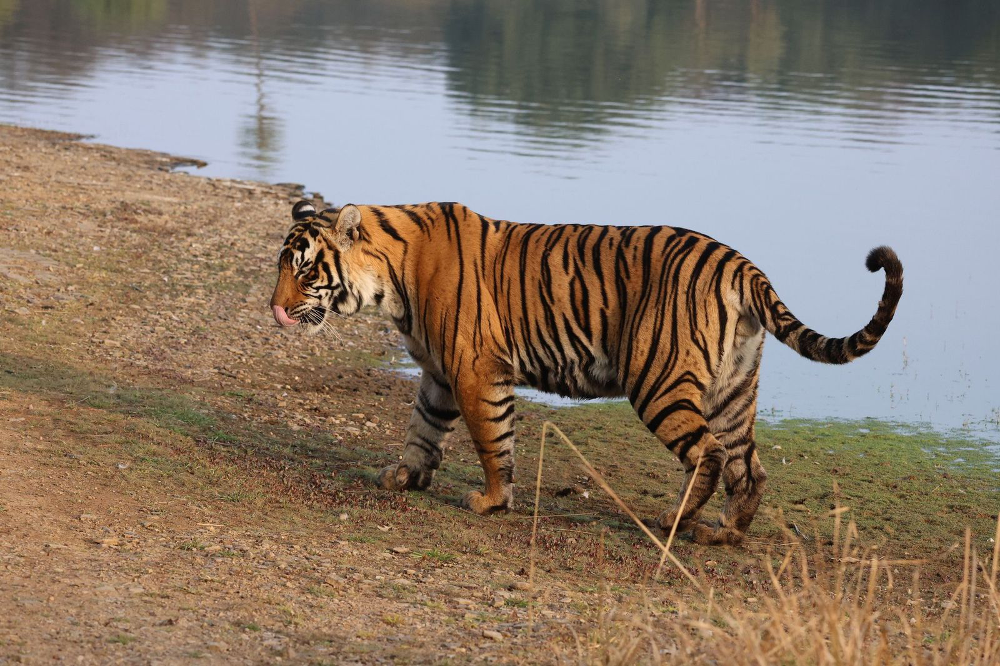

Reflections on a trip to India with my family.

------------------------------------------------------------------------

*Every shade of color — the deep reds from spices, the iridescent blues and bright orange of the kingfishers, the green of the palms along the backwaters — began to fade once I got on the plane back to London. And yet I knew that someone else returning from the same airport in Delhi would carry an entirely different palette. India doesn't arrive as a single image. It arrives as many, and yours is just one of them.*

## Section I: Sensations of India

I'd been looking forward to the trip for months. Two weeks with family, split between Kerala in the south and Rajasthan in the north. I was so excited for the food, the warm weather, and all the new experiences that would be coming our way. I was intentional about not looking too closely into where we were going. After all, it is not often when I go on a trip that I had no part in planning, so I figured it was a great time to remove any kind of expectation from the journey and just enjoy it.

The first thing that hit me was all of the color. Not in the way an image on your computer would have you believe, not as a postcard. It's more that color is everywhere, woven into the texture of the setting in a way that feels almost aggressive in its generosity. This is true from the houses, to the temples, to the flora and fauna. The food arrives in so many different shades, which is very exciting for me, as I knew that each time this meant a different flavor and experience. The buildings painted in burnt oranges and deep blues that have been sun-bleached into becoming something wholly new. One of the highlights of the trip was soaking in the sunset of Shapura, over the fields and the village, from a run-down castle on the top of a hill. It was an incredible sensory experience, hearing the bustle of the people in the town below, the birds flying by, the greenery of the vegetation that came from the impressive engineering work to make the area quite wet, and then the sunset. It took its time setting, which was very kind. It was moments like this that made the trip feel so special, getting to see and experience a completely new part of the world, together with my parents and sister.

And the food. I was so excited for this aspect of the trip, as I knew that there would be a breadth of different types of dishes that we would get to try. There's a warmth to how it's offered too, not just as sustenance but as something more like a gift. This came through from how many ingredients go into these dishes. Cooking Indian food, as I learned in the backwaters of Kerala during an interactive cooking session, and then back in London where I have been making more Indian dishes, is a labor of love. The time, intention, and care that goes into the dishes is second to none. Luckily for me, there are lots of amazing Indian restaurants and grocery stores in London.

The people were similarly powerful. There was a kindness and openness that felt unforced, nothing performative to it, no sense of people trying to make an impression. Conversations and moments together happened easily, sometimes even without a shared language. It wasn't the intense, searching kind of connection you might expect. It was more gentle than that. More like people were just being, present with each other and with you, without needing to make it anything more. These interactions and moments left a lasting impression on me.

I noticed, somewhere in the middle of it all, how different this felt from the morning commute on the tube back in London, being packed into a carriage with lots of people, almost everyone being sealed off in their own head. Not that I blame anyone for it, I do the same! It's early in the morning. But the contrast was sharp enough to notice.

## Section II: The Covenant of Water

And there is a book!

I'd started *The Covenant of Water* by Abraham Verghese a few weeks before we left. My parents have both read and spoke incredibly highly of it. I knew I had to read it! Especially because it is set in Kerala, where we spent the first week of the trip. From the first few chapters, it was clear this wasn't going to be a quick or easy read. It is over 700 pages and took me longer than any other book to finish, even ones that are a few hundred pages longer, due to the depth of the story. After the first hundred or so pages, I was so happy that it is as long as it is. Verghese writes with a unique immersive, unhurried intensity, pulling you into a world that is at once welcoming and overpowering, and refuses to let you look away from any of it. The story spans generations, weaving together love, loss, secrecy, and the persistence of family in a way that feels almost mythic, but never loses its groundedness. I can't speak highly enough of this story, and it is an essential component of how I reflect on our trip.

Kerala, where we spent our first week, is where the majority of the book takes place. Reading it there, it felt like the pages were confirming something I was already living, especially with how Verghese described some of the places where the story unfolds. The pace, something slow, steady, heavy with humidity and greenery, matched the rhythm Verghese was able to set in my head. It was one of those special experiences where a story and a place feed each other, where neither would have felt quite the same without the other.

And then, I came back to London.

Finishing *The Covenant of Water* back in London was one of the most intense experiences I've had with a book. The world Verghese had built, the warmth, the density, the sense of lives folding into and out of each other, was presented wonderfully. But everything around me had shifted. London is so many things, but it is not Kerala, especially in January. And yet the book pulled me back to Kerala as close as I think possible without actually being there. Finishing the book was somewhere in between the space of heartbreaking and healing. What struck me most was how the story never fully unwinds. Right until the very end, there's a tension that holds everything together. But woven through it are these smaller moments of release, threads that ease just enough to let you breathe before being pulled tight again. I think it's a large reason for the stories depth and complexity, and it's what made finishing the book feel so charged. The themes that had been building on the importance of family, the weight of secrets, the strange fragility and stubbornness of being human, all landed with a force that felt almost physical. It was one of the most powerful books I have ever read.

## Section III: The Tiger

Rajasthan is where the tigers are. We were fortunate to have 4 safari sessions, one in the morning and one in the afternoon, for 2 days. The safaris were 3 hours each, but felt much shorter as the time went by cruising along the impressively well-kept roads of Ranthambore National Park. We had a lovely guide and driver, both of whom were impressive and professional, and really added to the experience. The entrance into the park was jam packed, especially the morning of new years day when we had our first safari, because there is a temple in the park that is quite popular. So many taxis going back and forth, which marked the road into the park. It was a chaotic and vibrant scene which opens up once you are off the main road, as the park feels quite remote after just a minute off of the main route. That first morning, we had been going around for about two and a half hours, not having spotted a tiger yet, but our guide felt like he was on to one.

And then, in the thick, early morning mist, I saw two ears.

Just that — two small shapes in the grass. But something clicked before my brain had fully caught up. I knew it had to be a tiger. And look, there are plenty of deer around for this to easily have been a false positive, and you don't want too many of those adding up during a safari. The jeep moved forward, slowly and then quickly and then slowly again, and there it was. A Bengal tiger, lying in the cool, foggy morning lakeside, completely at ease. It wasn't performing. It wasn't doing anything at all, really. It was just there. Present, unhurried, itself. It was a young male tiger, but it was huge, it felt full grown to me. It was one of the most special moments of the trip, and probably any trip really. Moments that I am sure I won't ever forget.

There's something about seeing a wild animal like that, a species so renowned and ancient and powerful, existing completely outside of the world we've built, but also inside of the confines of the park, that puts things into perspective in an instant. It reminded me, in a way I hadn't expected, of the moments I had shared with all the people we met over the two weeks. A similar quality of being.

There was something in that moment, being in the mist, feeling stillness, seeing and experiencing the tiger, that I haven't been able to shake. Not in a grand way. More like something shifted.

## Section IV: Self-attention

The colors, the food, the people, the tiger, the book. None of it was earth-shattering or groundbreaking on its own. And yet something had definitely shifted. Somewhere along the way, without even really noticing it happening, something loosened. Like a grip that I didn't quite realize I was holding on to.

I think it had to do with the self. Not me, myself, but the self at more of a meta level. Bear with me.

So much of how we move through the world, especially in the West, especially in a city like London or New York City, involves a sort of constant, unavoidable self-narration. We're so often observing ourselves from the outside. Planning, evaluating, optimizing. When you think about developing a career, or processing a new piece of knowledge, or even just deciding how to present yourself in a conversation, you're stepping outside of yourself and looking back in. It's how we grow. It's how progress happens. There's real power in it. And most of the time, we don't even notice we're doing it. It just runs, quietly, underneath everything else.

But in India, something about that loop quieted. I don't think it was a conscious decision, more so something that the environment just made it harder to stay in. There is one day that really sticks with me. We spent several hours in a few small agricultural villages near Shapura. The interactions were easy, people were kind and gentle, and it felt conversations happened even without words being spoken at times. Our guide/friend/companion helped us translate, and so we did get to have some really engaging moments. At one point we met an elderly woman who was wearing some of the most incredible gold jewelry I had ever seen. They might not have been rich in a material sense, but it was unmistakable: the town was alive and rich in love and care for each other. People were living. It wasn't dramatic. It was more like a background hum I'd been so used to that I only noticed it when it got quieter.

And now, back in London, I find myself wanting more of that. Not in a way that means throwing out everything the self-aware, third-person thinking gives us. More like seeking out moments where that loop gets interrupted. New experiences, unfamiliar places, things that force the brain into the now rather than the what's-next. Moments where your entire perception of the world just shifts and sits still for a little while. I'm hoping it can become something that is more of a habitat than an exercise. The intention of this practice is one of the most important things that I feel like I came back to London with after the trip. Reading is one example of it: really sinking into a story the way Covenant demands of the reader. There's something about being fully inside someone else's world that quiets the self-narration in a way that's hard to get elsewhere. Another example is stretching. Since coming back I've been spending more time focusing on my physical wellness. There is something about being connected with your body and having really intense and purposeful moments that pulls you out of your head in a crazy way. Mental presence, physical presence. Two sides of the same coin. These are small habits, and I can't say I've got it figured out yet. I'm still a very inflexible human. But it's a start!

## Section V: Straw Dogs

Around the same time I was finishing Covenant, I picked up another book. Quite a different one.

*Straw Dogs* by John Gray is not an easy read in the way Covenant isn't an easy read. But where Covenant pulls you in with warmth and a beautiful story, Straw Dogs unsettles you. It's a blunt, self-imposing philosophical look at what it means to be human, and it seriously doesn't let you off the hook. I can't say I was expecting it to be such an interesting foil to Covenant.

Gray's central argument is unsettling. He says that humans are animals, but uniquely, almost cruelly in a way, trapped by self-consciousness. We are the only species that narrates its existence, that watches itself from the outside and builds entire systems of meaning around that. And what has really struck me: no matter how much we peel back, no matter how self-aware we become, there is always one final layer. Something irreducible. A part of the self that can never fully be understood. It's weird and unsettling to think about. It is something that Gray discusses at length and is a core reason for the strong emotional response that comes from the book.

I think of it like a strange kind of trap. The essence of what makes us human, our ability to reflect, to grow, to build, is also the thing that keeps us separated from something Gray seems to think is closer to the truth of how the world exists around us. Something more unified. Something we can innately sense but never quite reach.

Now this is where it gets interesting, and it might become clear why I am talking about this silly book, written by a depressed English professor, in a blog post about India! While I was in India visiting temples, witnessing rituals, moving through an array of different moments, I kept hearing a version of something that felt related. Hinduism, unlike Christianity or much of Western ideology, doesn't position God as a figure looking down from above. And that distinction matters more than it might seem. When God is above and separate, humans become the ones in charge. The observers, the stewards, the rational actors at the center of everything. Christianity built much of Western civilization on that principle, and Gray would argue it's baked into how we see ourselves now: as individuals, separate from each other and from the natural world, always looking outward and upward rather than recognizing what's already here. It's the foundation of the self-narration I mentioned earlier, the notion that we are the ones watching, and the world is the thing being watched T he idea at the heart of it, Brahman, is that the divine isn't separate from the world. Rather, it is the world. God is in everything, and everything is God. Not as a metaphor, instead as a philosophical claim about the nature of reality itself.

And I think, without knowing it at the time, I'd been preparing for it in a way. Flying in to Cochin airport, the first thing that hit me was the water. Rivers, lakes, the ocean, all stretching out below, all connected and one. It was something I'd been set up for since starting Covenant. Verghese had already planted the idea that water was the thing holding everything together. Seeing it from the air made it real. Then, swimming in the ocean further south of Cochin, feeling the warm water all around you, it was hard to think of water as just a kind of backdrop. It was more like something you were inside of, a part of.

That's what struck me most about how Hinduism isn't just a belief system practiced in certain places and at certain times. It is lived, and like water, it is persistent and life-bearing. Woven into the texture of everything in a way that Christianity, for all its influence on Western culture, has never quite managed. The temples, the rituals, the way spirituality sat with the mundane, it wasn't separate from life. And maybe that's why that sense of self-narration quieted there in a way it doesn't in London.

If the boundary between self and world is, at some fundamental level, an illusion, then the "final layer", the one that we can't crack, Gray is describing isn't a flaw in human nature. It's what happens when one, and many generations before, spend your existence believing in a separation that doesn't fundamentally exist. The separation is man-made, a result of all of the time that we have spent thinking about ourselves. This reminds me of the work we do at Zora Ecosystems to restore nature, which is necessary not due to humans thinking about humans so much, prioritizing growth and the notion of more over the well-being of all, not just humans. I quite enjoy philosophy, but it sure is exhausting at times!

Gray arrives at this road end through pessimism. Humans are trapped, progress is a myth, we can never fully know ourselves, he says. Hindu thought arrives at the same place, but through expansiveness. There is no self to know, because the self was never truly separate to start with. Two roads, same destination. And what strikes me now, sitting with both of these ideas after coming back from India, is how much the Western way of framing things, the individual, the rational self, the idea that we are the ones observing the world, might actually be what's getting in the way.

I don't have a neat answer to what I am laying out here. I'm not sure Gray does either: pessimism isn't really in the business of offering solutions. And I can't claim that two weeks in India gave me a spiritual awakening. But, there is something about holding these two ideas in the same place, the trap Gray describes, and the "way out" that Hindu philosophy frames, that feels closer to what I was experiencing and feeling in India than anything I'd thought about before. The tiger in the mist, just being. The matriarch in her gold, her town alive around her. The loop quieting, without any effort at all.

Maybe that's the point.

## Section VI: Moving Forward

Lots of the ideas I've mentioned here come through in the show *Pluribus*. I really enjoyed it, it's a sharp, unsettling piece of television. It successfully hits a lot of the same notes that Gray and Hinduism do: togetherness, separateness, selfishness, the self. How we see each other. What if we were all connected? It's not a perfect parallel, but I think it's worth mentioning. I love how the show makes you keep thinking and coming back to it, even though its been a little while now since I watched the last episode of the first season.

The trip to India was incredibly special. I feel lucky to have shared it with my family, and for my parents to feel like my sister an I would relish the experience. I came back wanting things to be different. Not in a sort of sweeping way, but in the smaller, more detailed ways. More presence. More aware of what's in front of me and having the feelings flow naturally, rather than narrating it from the outside. More curious about what happens when the loop gets interrupted. Right now, I'm thinking about the tiger we saw. Still out there in the mist, not caring about any of this, although I'm sure he would appreciate being the subject of this post. Just being.