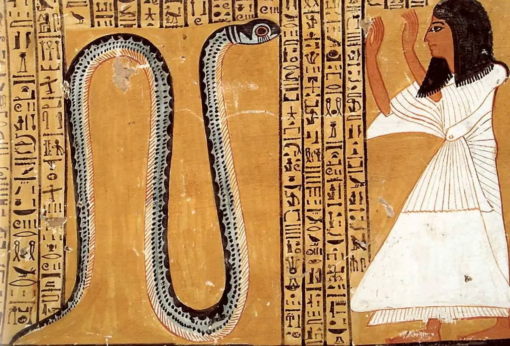

*DNA, shamanic knowledge, and what gets lost when we reduce the living world to labels*

# DNA

Every nucleated cell in the human body contains about two meters of DNA, all coiled up and packed into 23 pairs of chromosomes. You have roughly 30 trillion of those cells. This means you have somewhere in the region of 70 billion kilometers of DNA in total. It's kind of comforting to think about this I think, especially since we can sometimes seem so small in relation to our world. To add to the madness, DNA is not sitting still. It's being read, copied, repaired, and expressed differently depending on context, always responding to its environment, always selecting. Selecting which genes to express, which proteins to build, which signals to amplify and which to ignore. The word for that is older than molecular biology. Inter-legere: to choose between. Something in each cell is choosing.

We're notoriously good at being humbled by distance. The light-year, the deep time of geology, the universe expanding in every direction. But this is different. The strangeness here is not out there. It is right here, in our cells, which is to say, in ourselves. This means it is everywhere, which means it is hard to see. It takes a deliberate effort to feel its weight. Not to understand it though, understanding is easy enough. Or at least the outline of it is. But to actually feel how strange it is that the world organizes itself this way. That a four-letter code, endlessly rearranged, accounts for every living thing that has ever existed on this planet. That the same molecular logic runs through a blade of grass, a humpback whale, a fungus spreading quietly under a forest floor. That you are, at some level of resolution, made of the same four ingredients as every other living thing on earth.

What happens when we try to name the results of all this? And what do we lose when naming becomes the only way we know how to meet it? Two books I have worked through recently, Eucalyptus by Murray Bail and The Cosmic Serpent by Jemery Narby, have got me thinking about these questions and wanting to dig deeper.

# Plants

In 1990, Swiss anthropologist Jeremy Narby was living with the Ashaninca people in the Peruvian Amazon. He had gone there intending to study land rights. His experience led him in a different direction. The healers he lived with possessed a pharmacological knowledge of the rainforest that he could not explain. They knew which plants to combine, which preparations to use, and which remedies worked for which conditions. When Narby asked how they knew all this, the answer was consistent and unsettling: the plants had told them.

The first time that an Ashaninca man told him he had learned about the medicinal properties of plants by drinking a hallucinogenic brew, Narby thought he was joking. But the man was not smiling.

The brew in question is ayahuasca. It is made by combining two plants — *Banisteriopsis caapi*, a vine containing β-carboline alkaloids that inhibit monoamine oxidase A in the gut, and *Psychotria viridis*, a leaf containing DMT. Here is the quirk: DMT is nearly inactive when taken orally on its own. The gut degrades it before it reaches the brain. It just so happens that the β-carbolines in the vine inhibit exactly the enzyme responsible for that degradation, allowing the DMT to become orally active. The combination is pharmacologically precise and scientific. What is really mind blowing about this concoction is that the Amazon contains somewhere in the region of 80,000 different types of plant. The idea that this specific synergy was stumbled upon by trial and error is nearly impossible. When Narby pressed the shamans on this knowledge and how it came to be, they all returned to the same answer: the plants told us.

In Narby's ayahuasca visions, as in the visions described by shamans across Amazonian traditions, certain images recur with unusual consistency. Twin serpents. Twisted ladders. Luminous ropes coiling around each other. Narby began cataloging these images against the cross-cultural record, and discovered that the same forms appear in ancient Egypt, in Hindu iconography, in Greek healing traditions, in Mesoamerican cosmology, the list goes on. Quetzalcoatl, whose very name contains *coatl* — serpent, and also twin. The rod of Asclepius. The rainbow serpent of Aboriginal Australia. Shesha, the cosmic serpent of Hindu mythology, on whose coils Vishnu rests between universes. Narby's argument is that these images are not coincidental. That shamans, in altered states, are somehow perceiving the double helix itself — the molecular architecture of life — and encoding it in the only symbolic language available to them.

This is a hypothesis that is easy to dismiss, and in some ways it should be. The Publishers Weekly review of the book put the standard objection plainly: Narby appears to mistake enthusiasm for evidence, taking similarities of form, i.e. any helical pattern, any serpentine figure, as proof of connection. The human visual system under psychedelics reliably produces certain patterns regardless of culture: spirals, grids, tunnels, branching forms. These are generated by the architecture of the visual cortex itself, not by anything external. A spiral will look like a double helix. That does not require a cosmic explanation, per se. 

Convergent evolution is the cleanest frame here. The eye evolved independently at least forty times across animal lineages. That's the same optical solution arrived at by species with no shared ancestor. Perhaps the serpent image works like this: it's not transmitted or perceived from some shared source, but generated independently wherever a certain depth of altered attention meets the same underlying architecture. The neuroscientist Heinrich Klüver catalogued the recurring shapes of psychedelic hallucinations in the 1920s and called them "form constants", things like tunnels, lattices, cobwebs, and spirals. The reason they are universal is structural: the retina maps the world in polar coordinates, and when those signals reach the rectangular strip of the visual cortex, a straight line in the brain becomes a spiral in experience. You don't see a spiral because something outside you is shaped that way. You see it because the visual cortex, when it misfires, generates its own geometry. But the same spiral keeps appearing in the growing tip of a sunflower, in the scales of a pinecone, in the whorls of a nautilus shell. Mathematicians call this phyllotaxis, or the tendency of growth under geometric constraint to settle into Fibonacci spirals, because that arrangement is the lowest-energy configuration available. The angle between each successive seed in a sunflower head is almost always 137.5 degrees, a number derived from the golden ratio, because that is what maximal packing under constraint produces. Nature collapses into a shape, and that shape keeps being the spiral. Two different processes, a cortex misfiring, a seed finding its place, arriving at the same form. That, in theory, could be the whole story. Or it may be why the whole story feels incomplete.

The spiral, it turns out, is where the brain and the living world independently arrive. That this keeps happening — cortex and sunflower, shaman and mathematician, reaching the same form by completely different routes — is precisely the kind of coincidence Narby spent a book trying to account for. There is something deeply human in that search, the desire to find a single thread running beneath all of it, and he knows the question may be too large to answer cleanly. The universality is real. The explanation is probably more neurological than cosmic, which is its own kind of strange. Although a softer version of Narby's claim survives the skepticism: that the shamanic state might not be perceiving the literal double helix, but something closer to the latent structure beneath the forest's surface, the deep pattern that generates all the variation, accessed through a different instrument than the microscope.

And yet, you can strip away the DNA linking hypothesis and the puzzle Narby is pointing at does not disappear entirely. The pharmacological knowledge is real. The cross-cultural convergence of the serpent image is real. And the deeper question he is circling — how did isolated communities develop such sophisticated ecological knowledge, and through what mode of attention — remains an open question that proves extremely difficult to answer with the scientific method.

What becomes evident reading this book is that the shamans Narby lived with were not operating within anything resembling a Western epistemology. They were not classifying, cataloging, or extracting things in their lives. The anthropologist Lidia Guzy describes indigenous shamanic worldviews as a "dialogic eco-cosmology", or a mode of knowing in which nature is not mute matter waiting to be analysed, but instead a field of presences with their own agencies and motivations, which the shaman is able to decodes and mediate. Plants in Amazonian tradition are addressed as *la medicina* — medicine, teacher, interlocutor. They are not objects or means to an end. They are humanized since they have something to say and show.

This experience of the Amazonians is not a primitive approximation of science. It is a different ontology entirely, and it is not unique to the tropics. The same dialogic knowing appears wherever humans have lived in high-stakes intimacy with their environment. The distance between that ontology and Western ideas is neatly illustrated by a quick episode from 1821. A British Arctic expedition led by William Parry found itself stuck, its instruments broken and useless, charts inadequate for the ice it had found itself up against. The expedition consulted an Iglulingmiut shaman named Toolemak. He entered a trance, and predicted that the ice would repel the ships at Fury and Hecla Strait. And he turned out to be right. The point of this, and this blog post really, is not that shamanism is magic. For both the British and the Inuit, the purpose of the séance was identical. The methods could not have looked more different. The system being read was the same.

# Inventory

The shamans of the Amazon learned from the forest. The West chose to catalogue it.

Murray Bail's novel *Eucalyptus* opens with a declaration. A man named Holland has spent years planting his property in New South Wales with a few hundred species of eucalyptus. Every variety he could source is methodically placed, labelled, catalogued. He then announces that the man who can correctly name every tree on the property will win the hand of his daughter, Ellen. The story is structured as an Australian fairy tale, rooted by how Holland turns a landscape into an inventory and offers his daughter as the prize for completing it.

Many suitors come in to attempt the test. The most skilled of them is a man named Mr Cave. He is precise, exhaustive, and comfortable with the technical vocabulary of botanical taxonomy. He "employed with lip-smacking relish the terms 'petiole,' 'inflorescences,' 'falcate' and 'lanceolate.'" He moves through the property with the confidence of someone who believes that to name a thing is to possess it. He gets very close to winning. And yet Ellen, lying ill and barely conscious in her bedroom, is unmoved. His naming drains the life out of her.

Holland's project, and Mr Cave's approach to it, belongs to a long tradition. Linnaeus formalised binomial nomenclature in the mid 18th century, partly as a response to the flood of new species arriving in Europe from its colonial territories. It was an accounting system — a lossy compression of biological diversity into something transmissible. And like all compression, it required a decision about what counted as signal and what counted as noise. Linnaeus decided that signal was the morphology: the shape of the leaf, the structure of the flower, the arrangement of the stamens. Noise was everything else. The name a plant already had in the language of the people who had lived alongside it for centuries. The specific hillside it came from, the fungal network threaded beneath it, the seasonal relationships it held with particular birds and insects and soils. None of that survived the translation. You gain legibility across languages and centuries — a botanist in Uppsala and a collector in Calcutta can now refer to the same plant unambiguously — but you lose the particulars, the relationship a thing has with its environment. The writer Jamaica Kincaid, reflecting on the colonial history of botanical naming, frames this bluntly: to name is to possess. The plant had no history, no name of its own that counted, and so it could be given one. Holland's contest is the colonial project in miniature — New Holland, as Australia was once called, subjected to the same logic of enumeration and possession that shaped the empire itself.

One of my favorite bits of Bail's novel is that it does not offer a simple romantic counter to this. The trees in *Eucalyptus* are not lingering in the human drama. They are not whispering to the stranger, guiding his stories, lending him their ancient wisdom. They are silent, indifferent to the people moving beneath them. Bail has a phrase for what classification does to the discomfort of standing in front of something that resists full understanding. He calls it "an escape from the darkness of the forest."

Holland prepared labels for every tree on the property, intending to fit them to the trunks. They ended up gathering dust in his office. A name prepared and never attached is already a kind of admission — that the label was not quite the point.

# Care

The most interesting character of *Eucalyptus* is a stranger. He appears under the trees on Holland's property and begins telling Ellen stories. They aren't stories about the trees. Rather, they're stories about people, human affairs, ordinary and strange alike. He never actually names the trees. And he never attempts the contest. For the entire novel, he remains unnamed. At the end of the story, Ellen recovers. She had been waning under Mr Cave's taxonomy, and she revives under the stranger's stories.

It would be easy to read this as an argument against naming. But I don't think that's quite right, and it's important to be careful here. Knowing the names of things — and I mean really knowing them, in the way a dedicated birdwatcher knows every species by its call, or a botanist knows a plant by the shape of a single leaf — is usually a sign of something admirable. It is a sign of care. I imagine that the people who know the most Latin names are often the people most devastated when a species goes extinct. The taxonomy is not the problem. If anything, it is the evidence of a prior care and passion.

The problem really is when the naming becomes untethered from that care. When the label replaces the encounter rather than deepening it. Mr Cave is not a villain because he knows the technical vocabulary of eucalyptus taxonomy. He is a villain, or something like one, because the vocabulary is all he has. He moves through Holland's property like a man completing a form. The trees are there to be identified, checked off and filed. There is no sense that he has ever just stood under one and felt anything. His knowledge is vast and his attention appears to be elsewhere.

The history of environmental degradation is a history of people who knew, or cared, almost nothing about it. The forests that have been cleared, the species driven to extinction, the peatlands drained, these were not acts carried out by people who cared deeply for the landscape and its future. They were carried out by people for whom the forest was already an abstraction, a resource, a line on a balance sheet. The accounting system that taxonomy can become is dangerous not because it names things but because, in the wrong hands, it names them without seeing them.

This is why the shamans remain so striking. They are not incurious about the natural world, it is really quite the opposite. The pharmacological knowledge that Narby documented represents a depth of botanical attention that most Western scientists find humbling, per Narby's experience. But that knowledge was always embedded in something larger than curiosity. It was embedded in relationship, in obligation, in a cosmology that did not draw a clean line between the knower and the known. At a lecture I attended at the Royal Geographical Society earlier this year, a speaker described how certain Amazonian communities think of the great ancient trees of the forest not as resources, not even as neighbours, but as relatives. They say that the spirits of people will live on in the largest trees in the rainforest.

The distance between most people and flora and fauna is not inevitable. It is the result of choices about what counts as knowledge and what counts as progress. Humans constructed a system that is extraordinarily good at generating transmissible, scalable understanding. That system has given us conservation biology, and modern medicine, and the ability to identify and protect endangered species. These are real and important things. But somewhere along the way, the naming became the endpoint rather than the beginning. The inventory a destination rather than a starting point for something deeper. The living thing becomes a question of utility rather than of relationship.

Narby, in a later interview, was asked what is spiritual in his life. His answer was quieter than you might expect from the author of a book about cosmic serpents and shamanic visions. He said:

> I look after the plants in my garden, without using pesticides. But I do this because I think it needs doing, and because it's all I can do.

Not a grand claim at all. Just tending, because it needs doing. The naming and the knowing in service of something that doesn't need to be named at all.

At the end of *Eucalyptus*, Ellen is humming. She is not married, not categorized, not fixed to anything at all. The novel actually ends right before the final tree can be named. Holland's labels are still in his office, gathering dust. That's not due to the names being wrong, but because some things just resist completion. The inventory was never quite finished, and the novel seems to suggest this is not a failure but more like a kind of mercy. The world was doing something extraordinary long before we arrived to describe it. The question is not whether we name it. It is whether, in the act of naming, we remember that the thing existed before the name, and will hopefully exist long after.

# Immanence

Let's get back to the facts. Seventy billion kilometers of DNA, the same four-letter code, running through the fungus and the eucalyptus and the anaconda coiling through the Amazonian undergrowth and you, dear reader. This is a biological truth. The molecular substrate of life is shared. Everything that has ever existed on this planet is, at some level of resolution, made of the same ingredients.

Science arrived at this through sequencing and electron microscopy and decades of laboratory work. Hindu cosmology arrived at something structurally similar thousands of years earlier — the idea of Brahman, the divine not as a figure above and separate from the world, but as the substance of it. Immanent in everything. Not God looking down at nature, but God as nature, running through the blade of grass and the predator and the decomposing leaf with equal indifference to the distinction. The Amazonian shamans arrived there too, through centuries of living inside a forest so dense and alive that the curtain between self and world simply fell. Three routes to the same place.

What Narby and Bail leave me with is not an argument against the inventory. The naming matters. The science matters. And yet knowledge of the living world carries a responsibility that science alone cannot generate. You cannot legislate your way into feeling that the oldest tree in the forest holds the spirit of a late relative. But you can choose to live as though the world deserves something more from you than a name. The astonishment should come before the label, and stay after it. This is what inter-legere points toward: not the accumulation of names, but the willingness to keep choosing to be present to what is being named.